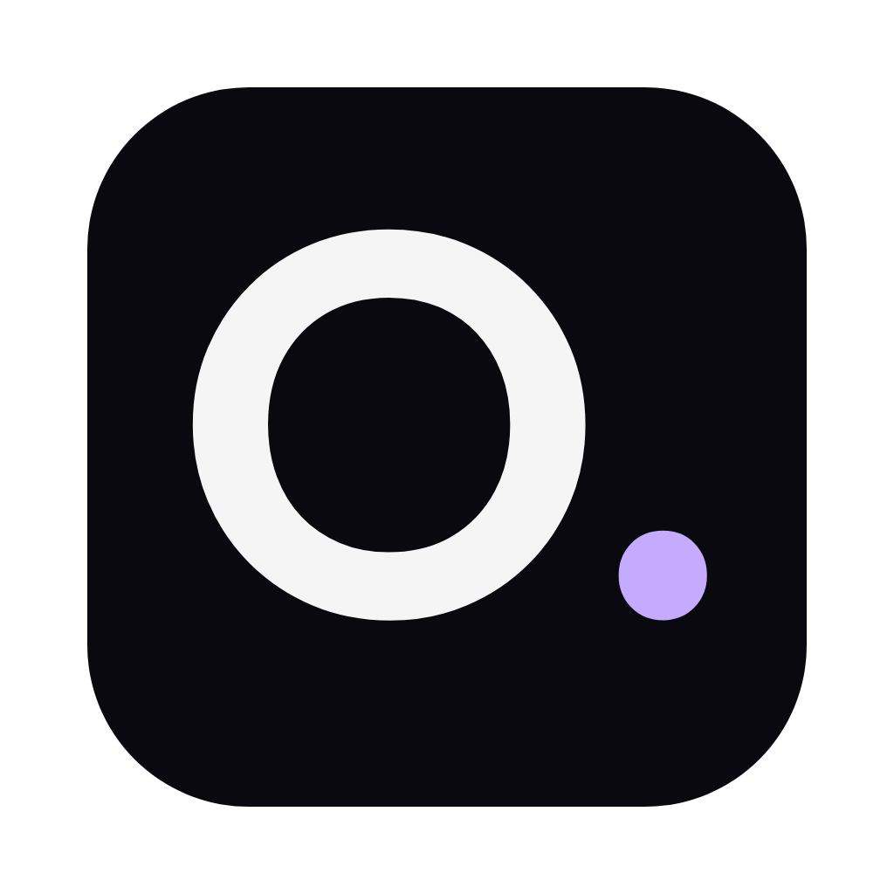

# Operecs



A basic cross-platform web browser built on Electron.

## Download

Get the latest version from the [releases page](https://github.com/ezzeldinzozz-svg/operecs-browser/releases/latest):

| Your computer | File |
| --- | --- |
| Mac with Apple silicon (M1 and later) | `Operecs-<version>-arm64.dmg` |
| Mac with Intel | `Operecs-<version>.dmg` |
| Windows 10 and 11 (64-bit) | `Operecs-Setup-<version>.exe` |
| Linux (64-bit) | `Operecs-<version>.AppImage` or `browser_<version>_amd64.deb` |

Operecs updates itself after that.

## Features

- Tabs, address bar with search, back/forward/reload
- Bookmarks, history, downloads, find in page
- Per-site permission prompts (camera, microphone, location, notifications, …)
- Hardened by default: sandboxed tabs, private `browser://` pages, locked-down Electron fuses

## Develop

```bash
npm install
npm start
```

## Build

```bash
npm run dist:mac     # dist/Operecs-<version>-arm64.dmg
npm run dist:win     # Windows installer
npm run dist:linux   # AppImage and .deb
```

macOS builds are ad-hoc signed. On first launch, allow the app in
System Settings → Privacy & Security → Open Anyway.

## License

GPL-3.0-or-later (see `LICENSE`). Chrome extension support comes from
[electron-chrome-extensions](https://github.com/samuelmaddock/electron-browser-shell), which is
GPL-3.0, so the browser as a whole is GPL-3.0. Versions up to 0.9.0 were released under MIT.
